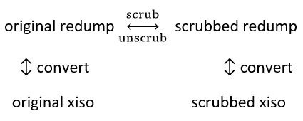

# xbox_shrinker
This program will overwrite (scrub) the random padding found in (OG) xbox iso files with a regular pattern making them highly compressable.  
The iso files need to be in redump format.
The scrubbed iso is still fully functional and can be used in emulators etc.  
The uncompressed size will stay the same but compressed scrubbed isos are usually several GB smaller than the unscrubbed compressed counterparts.  
The program also supports unscrubbing of the iso and reconstruction of the original file.

# Credits
* [LedZeppelin68](https://github.com/LedZeppelin68/dvd-shrinker) for his dvd_shrinker program. This is actually a (almost) completely rewritten version of his program. What basically remained in this code is his excellent multi-core implementation of the seed brute-forcer.
* [XboxDev](https://github.com/XboxDev/extract-xiso) for extract_xiso. Parts were used (but completely rewritten) for the analysis of the iso layout. 

# On the random padding
Random padding data is generated by a cryptographic function that generates a stream of random bytes with the use of a seed value. This stream of random data is written to the unused areas of the game partition.  
Random data has a compression ratio of 0%. Therefore, less gamedata often means worse overall compression, whereas in scrubbed images the opposite is true.  
If the seed value for the random stream is known, the random padding data can be reconstructed.  
Early xbox games used a (proprietary) stream algorithm, that uses a 32-Bit seed. This seed can easily be brute-forced in less than a minute. Unfortunately, Microsoft decided later to change the stream algorithm to rc4-drop-2048 with a seed key size of 128-Bits, which is too large to brute-force.

# Handling of rc4 stream games

For games that use the rc4 algorithm for padding, the random stream can optionally be separated from the iso and saved to a .rc4 file. This file is needed if you want to reconstruct the scrubbed iso to the original iso.  
The idea is to store the rc4 stream files to a (maybe less expensive) cold storate and keep the scrubbed isos for everyday use.  
For games that use the proprietary Microsoft algorithm, no rc4 stream file is created. Reconstruction is possible with the 32-Bit seed.

# ss.xml  
This file, if present, will speed up the processing of an image file.  
For processing, you need the seed key (for non-rc4 games) and the security sector ranges (for all games).  
These can be calculated, but you can provide the info directly in the ss.xml and skip these steps.  
The ss.xml has the following format (with one example entry):  
```
<datafile>
  <rom name="Medal of Honor - Frontline (Europe).iso" md5="79ab5eb5c6b85f84251b36d062e9fce3" seed="" ssrange="292904:296999,445066:449161,637988:642083,830074:834169,989386:993481,1145254:1149349,1295804:1299899,1452676:1456771,1984150:1988245,2296762:2300857,2444274:2448369,2598770:2602865,2760160:2764255,2912312:2916407,3067248:3071343,3300562:3304657" />
</datafile>
```

# Features
Improvements over LedZeppelin68's dvd-shrinker
* for the scrubbing process, the ss.xml is *optional* (lack of ss.xml will increase processing time)
* speed improvement for scrubbing process when ss.xml is used (due to new algorithm)

new features
* for the unscrubbing process, the ss.xml is **not** used or needed
* supports scrubbing of **all** iso files
* supports unscrubbing of **all** iso.dec files (rc4 stream games need a .rc4 file present, created at scrubbing process)
* Entries not found in ss.xml are added automatically

planned features
* Support for Xbox360 isos

## Requirements
On Windows you need to have Microsoft .Net installed.  
On Linux you need to have mono installed.

## Usage  
If you want to make use of a ss.xml file, it needs to be in the same directory as the executable.  
If it does not exists, a ss.xml file will automatically be created when processing your first file and all data will be updated with every file processed.  
**Scrubbing and unscrubbing**
```
xbox_shrinker.exe <iso/iso.dec file>
```
When unscrubbing a rc4 stream game named `gamename.iso.dec`, the program expects a .rc4 file names `gamename.rc4`.  
Alternatively, you can specify the rc4 file specifically using
```
xbox_shrinker.exe <iso.dec file> <rc4 file>
```
On Linux the commands need to be prepended by `mono`

# Metadata
To be able to unscrub an image without the need for external files or information (apart from the rc4 file), metadata is stored in the scrubbed file during the scrubbing process.  
The information is stored at the beginning of the first junk sector of the game partition.  
Offsets in the table below are relative to the offset of the first junk sector of the game partition.

| Offset | Type       | Decription                                                  |
|--------|------------|-------------------------------------------------------------|
| 0      | uint32     | flag for seed (1) or rc4 (0)                                |
| 4      | uint64     | seed value or sector count of rc4 file                      |
| 12     | uint64     | space for possible future storage of rc4 seed key           |
| 20     | byte\[16\] | MD5 hash of original file                                   |
| 36     | uint32     | Count of security sectors (always 16 for OG XBOX)           |
| 40     | 32x uint32 | start- and endsector for each security sector range         |

# xiso support  
This program supports redump-style isos only. The main reason is the md5 checksum stored in the scrubbed file that would be different for a file in xiso format.
For conversion you can use [this tool](https://github.com/Qubits01/redump2xiso).  
To create and use scrubbed xiso images, please refer to the following diagram:
<p align="center">

</p>

# Bug report
The current version has been tested successfully with almost 400 different image files.  
But please be aware that there might still be bugs present. There are some checks that the program does internally when processing a file so whenever the program quits with an error please open an issue. Not all errors might be identified by the program, though.  
Other ways to check if the file was processed successfully are:
* unscrub a scrubbed file. The program will calculate the hash and compare it to the hash of the original file.
* compare the filesize of the compressed unscrubbed image with the sum of the filesizes of the compressed scrubbed image and the rc4 file. These 2 values should be almost identical. If you get a deviation of more than 100 MB, open an issue.
